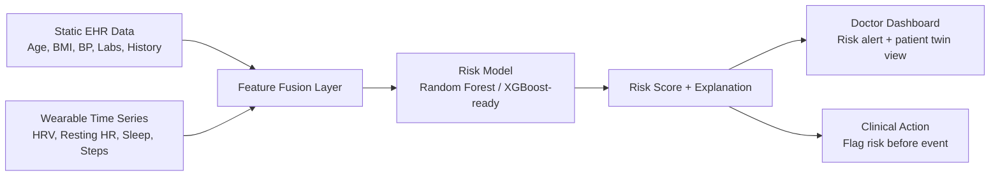

# CardioTwin

CardioTwin is a digital-twin proof of concept for predicting hypertensive and cardiovascular risk episodes by fusing static patient health history with dynamic wearable trends.

## Problem statement

Cardiovascular risk and hypertension are common and clinically significant conditions. Predicting an elevated-risk episode before it occurs can help clinicians intervene earlier and reduce complications.

This project builds a Phase 1-style prototype using synthetic EHR data and simulated wearable signals to demonstrate how a digital twin could identify a patient moving toward a risky cardiovascular state in the next 24–48 hours.

## Solution overview

The system combines:

- static EHR features: age, sex, BMI, blood pressure, cholesterol, smoking, diabetes, family history
- dynamic wearable features: heart-rate variability (HRV), resting heart rate, sleep hours, sleep efficiency, activity, steps
- a risk model trained to output a probability of an imminent cardiovascular event

The core concept is a patient-level digital twin that tracks trends over time and warns when risk crosses a threshold.

## Project structure

```text
cardiotwin/
├── README.md
├── data/
│   ├── generate_ehr.py
│   ├── wearable_sim.py
│   └── sample_patients/
├── fusion/
│   └── feature_pipeline.py
├── model/
│   ├── train.py
│   ├── evaluate.py
│   └── explain.py
├── api/
│   └── app.py
├── notebooks/
│   └── exploration.ipynb
├── docs/
│   └── submission.md
└── requirements.txt
```

## Data pipeline

1. Synthetic EHR generation: realistic patient records are generated with a Synthea-like approach.
2. Wearable simulation: time-series signals are generated to include worsening HRV, rising resting HR, fragmented sleep, and falling activity before an adverse event.
3. Fusion layer: static and dynamic features are aligned into patient-day records and rolling windows.
4. Risk model: a robust baseline classifier predicts the probability of a high-risk event in the next 24 hours; this can later be upgraded to XGBoost or an LSTM-based approach.
5. Explainability: feature importances and SHAP-style explanation are generated to make the risk signal understandable to clinicians.

## Architecture overview



## Demo flow and "aha" moment

1. Select a patient from the cohort.
2. View their static EHR summary and wearable trend history.
3. Observe the deterioration pattern: HRV declines, sleep quality worsens, resting heart rate climbs, and steps fall.
4. The model flags the patient as high-risk before the adverse event window.
5. The explanation panel highlights the main drivers: poor sleep quality, declining HRV, rising resting HR, and reduced activity.

This is the core demonstration: a digital twin that warns before a likely cardiovascular episode rather than after the fact.

## One-minute submission pitch

CardioTwin is a digital-twin solution for cardiovascular risk prediction that fuses static patient health records with dynamic wearable behaviour to anticipate hypertensive episodes before they happen. In a privacy-safe sandbox setup, we generate synthetic EHR profiles and wearable trajectories that show the signature of worsening physiological stress: falling HRV, poorer sleep, reduced activity, and rising resting heart rate. The model estimates next-24-hour risk and presents the result in a clinician-friendly dashboard. This is a prototype demonstration, not a clinical decision system.

## How to run

```bash
cd cardiotwin
python -m venv .venv
.venv\Scripts\activate
pip install -r requirements.txt
python data/generate_ehr.py
python data/wearable_sim.py
python fusion/feature_pipeline.py
python model/train.py
python model/evaluate.py
python -m uvicorn api.app:app --reload --port 8000
```

The old static HTML dashboard has been removed. In a second terminal, run the React frontend from this project folder's `../frontend/` directory with `npm install` and `npm run dev`.

## Google Colab workflow

Yes — you can train the model in Google Colab and keep the project in VS Code. The practical workflow is:

1. Copy the project folder into your Google Drive.
2. Open Google Colab and mount Drive.
3. Navigate to the project folder and run the notebook in [cardiotwin/notebooks/cardiotwin_colab_training.ipynb](cardiotwin/notebooks/cardiotwin_colab_training.ipynb).
4. Save the trained model back to Drive, then pull or sync the updated files in VS Code.

Typical Colab commands:

```python
from google.colab import drive
drive.mount('/content/drive')
%cd /content/drive/MyDrive/cardiotwin
!python data/generate_ehr.py
!python data/wearable_sim.py
!python fusion/feature_pipeline.py
!python model/train.py
!python model/evaluate.py
```

This is the easiest way to use Colab for GPU/compute-heavy training while keeping your code editor workflow in VS Code.

## Submission fit

This project is intentionally designed to match a university or hackathon-style innovation submission:

- clinically relevant use case
- synthetic but realistic data pipeline
- explainable model output
- doctor-facing dashboard mockup
- well-structured repo for documentation and review

## Important note

This is a proof-of-concept and not a production clinical decision system.
