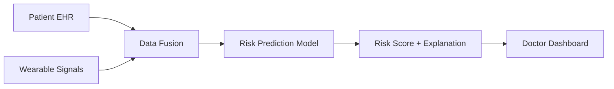

# CardioTwin Submission Write-up

## 1. Project title
CardioTwin: A Digital Twin for Predicting Hypertensive and Cardiovascular Risk Episodes

## 2. Problem statement
Hypertension and cardiovascular risk are highly prevalent and clinically important conditions. Early warning systems can help identify deterioration before a major event occurs. This project explores a digital-twin concept that fuses static healthcare history with wearable trend signals to predict likely risk episodes in the next 24–48 hours.

## 3. Motivation
This use case is particularly suitable for a Phase 1 proof-of-concept because it combines rich, realistic, synthetic EHR patterns with wearable data that are commonly available in public research datasets. It allows a model to flag a patient who is trending toward higher risk before an event occurs, which is more demonstrable than many other health prediction tasks.

## 4. Proposed solution
The system creates a patient digital twin from:
- static EHR features like age, BMI, blood pressure, cholesterol, family history, smoking, and diabetes
- wearable signals such as HRV, resting heart rate, sleep quality, and activity

The digital twin then predicts whether the patient is likely to experience a high-risk episode soon. The overall workflow is simple, explainable, and suited to a demo environment.

## 5. Data pipeline
A synthetic pipeline is used because real medical data is restricted by privacy and governance requirements. This project follows a sandbox-safe approach by generating synthetic EHR profiles and simulated wearable time series with risk patterns such as:
- falling HRV
- rising resting heart rate
- reduced sleep quality and hours
- lower daily activity

These patterns are injected before a labeled risk event to mimic a realistic patient deterioration sequence.

## 6. Model approach
The proof-of-concept uses a tabular machine learning model trained on fused patient-day features. The model is intentionally interpretable and easy to explain to a non-technical audience. Future extension could include XGBoost or LSTM-based time-series modeling.

## 7. Architecture overview

## 8. Demo flow and high-impact moment
The key demonstration is the model predicting an elevated risk state before the labeled adverse event. In the example workflow, a patient's HRV falls, sleep efficiency drops, activity shrinks, and resting heart rate rises. The digital twin flags this pattern before the cardiovascular event window, and the dashboard explains exactly which trends are driving the score.

## 9. How the dashboard helps
The doctor-facing dashboard shows:
- patient summary card
- trend display for heart rate variability, sleep, and activity
- alert banner when risk crosses a threshold
- explanation of what the model is using to make the decision

This makes the prototype understandable and clinically relevant.

## 10. Expected impact
CardioTwin demonstrates a clear clinical AI workflow for digital-twin monitoring. Although it is a prototype, it shows how a future system could support early interventions, better monitoring, and preventive care planning.

## 11. Limitations
This is not a medical device and is not meant for real patient diagnosis. It is a sandbox-safe demo created to show how a real healthcare AI system could be designed, documented, and presented.

## 12. Final summary
CardioTwin addresses a clinically important and practically demonstrable healthcare use case. By combining static risk factors with dynamic wearable trends, it shows how digital twins can provide actionable early warnings in a privacy-safe and explainable way.
